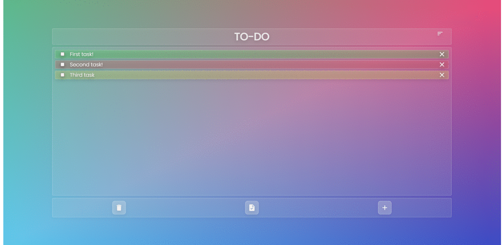

# TODO

A light-weight TODO app with glassmorphic UI.

This project was generated with [Angular CLI](https://github.com/angular/angular-cli) version 13.1.2.

## Features
* Persistant data local storage.
* Add task with their priority.
* keep track of completed tasks.
* Sort tasks by their priority with a simple click.

## Development server

Run `ng serve` for a dev server. Navigate to `http://localhost:4200/`. The app will automatically reload if you change any of the source files.
## Build

Run `ng build` to build the project. The build artifacts will be stored in the `dist/` directory.

## Further help

To get more help on the Angular CLI use `ng help` or go check out the [Angular CLI Overview and Command Reference](https://angular.io/cli) page.

## App preview

